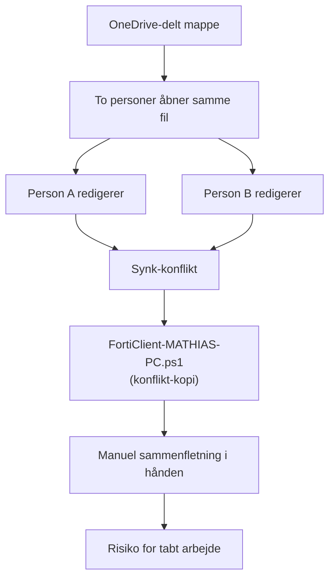
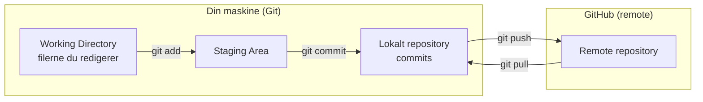
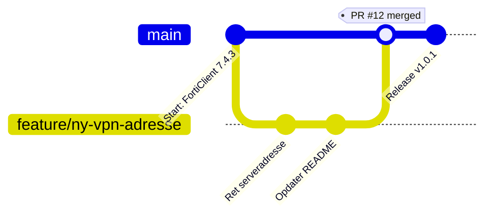
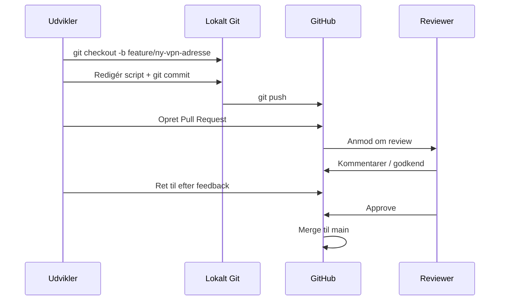
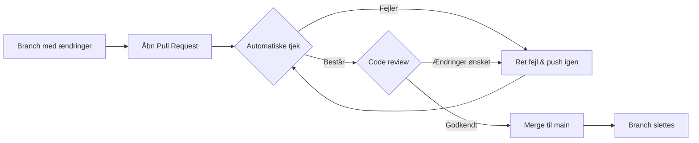
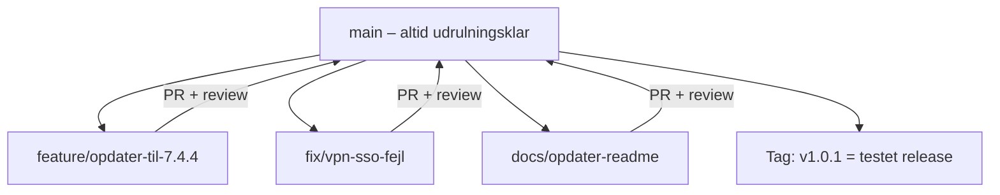
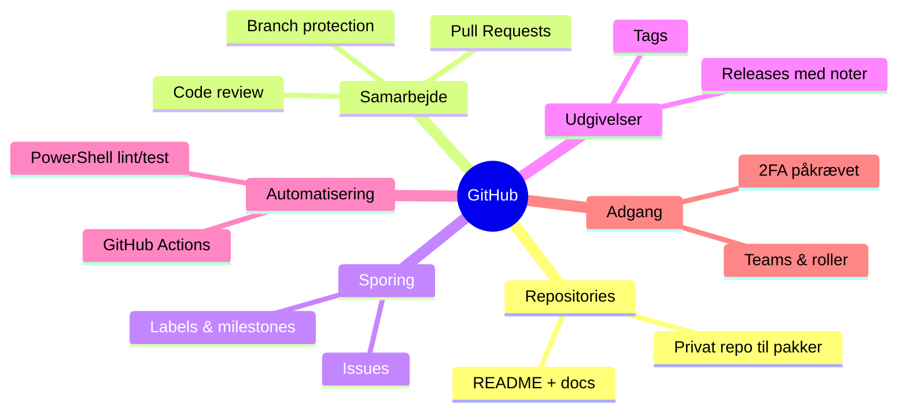
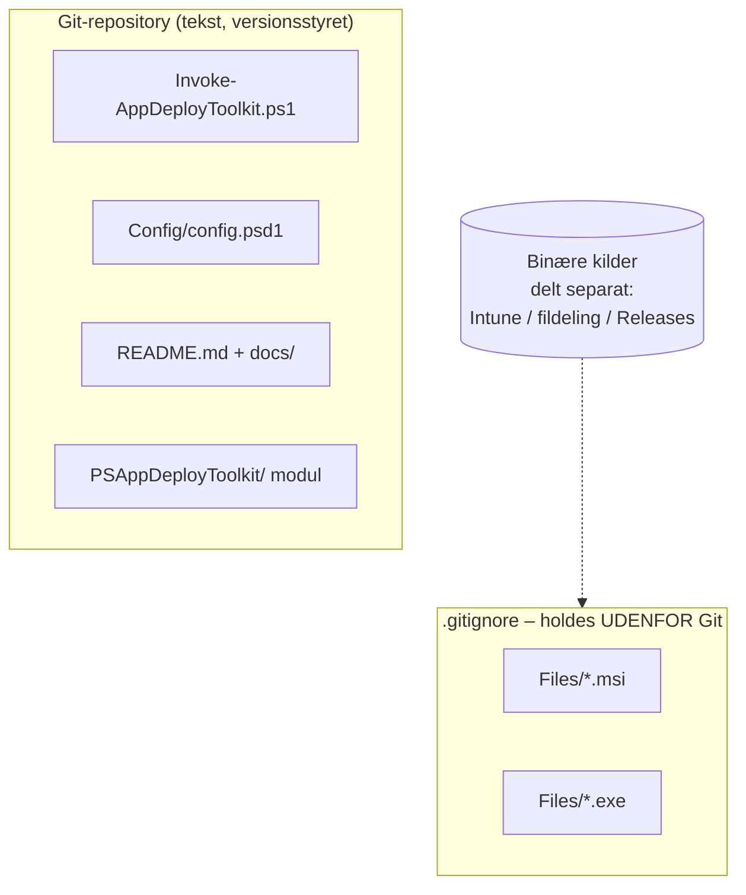
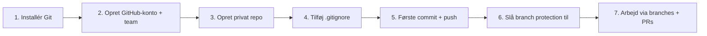

# Fra OneDrive til Git & GitHub – en komplet undervisningssession

> Et praktisk kursus i hvorfor og hvordan vi bør flytte vores deployment-pakker (fx denne FortiClient/PSADT-pakke) fra OneDrive over på Git og GitHub.

---

## Indholdsfortegnelse

1. [Hvorfor overhovedet skifte?](#1-hvorfor-overhovedet-skifte)
2. [Problemet med OneDrive som versionsstyring](#2-problemet-med-onedrive-som-versionsstyring)
3. [Hvad er Git – og hvad er GitHub?](#3-hvad-er-git--og-hvad-er-github)
4. [Grundbegreber: repository, commit, branch](#4-grundbegreber-repository-commit-branch)
5. [Arbejdsgangen i praksis (branches & PRs)](#5-arbejdsgangen-i-praksis-branches--prs)
6. [Pull Requests og code review](#6-pull-requests-og-code-review)
7. [En anbefalet branching-model for os](#7-en-anbefalet-branching-model-for-os)
8. [GitHub-funktioner vi bør bruge](#8-github-funktioner-vi-bør-bruge)
9. [Konkret: vores FortiClient-pakke i Git](#9-konkret-vores-forticlient-pakke-i-git)
10. [Kom godt i gang – trin for trin](#10-kom-godt-i-gang--trin-for-trin)
11. [Cheat sheet – de vigtigste kommandoer](#11-cheat-sheet--de-vigtigste-kommandoer)
12. [Ordliste](#12-ordliste)

---

## 1. Hvorfor overhovedet skifte?

I dag deler vi pakkerne via OneDrive. Det virker lige indtil det ikke gør. Spørg dig selv:

- Hvem ændrede VPN-serveradressen i `Invoke-AppDeployToolkit.ps1`, og hvornår?
- Kan vi gå tilbage til den version, der virkede i sidste uge, hvis en ny ændring brækker installationen?
- Hvad sker der, hvis to personer redigerer samme script samtidig?
- Hvordan ved en kollega, *hvorfor* en ændring blev lavet?

Med OneDrive er svaret typisk "det ved vi ikke". Med Git er svaret altid dokumenteret.

| Behov | OneDrive | Git + GitHub |
|-------|----------|--------------|
| Fuld historik på hver fil | ❌ Begrænset / 30 dage | ✅ Komplet, for altid |
| Hvem ændrede hvad og hvorfor | ❌ Nej | ✅ Hver commit har forfatter + besked |
| Arbejde parallelt uden at overskrive hinanden | ❌ "filename (1).ps1" | ✅ Branches |
| Gennemse ændringer før de udrulles | ❌ Nej | ✅ Pull Requests |
| Gå tilbage til en tidligere version | ⚠️ Besværligt | ✅ `git checkout` / revert |
| Markér en testet udgivelse | ❌ Nej | ✅ Tags & Releases |
| Automatisk test/validering | ❌ Nej | ✅ GitHub Actions |

---

## 2. Problemet med OneDrive som versionsstyring

OneDrive er fremragende til at synkronisere filer. Men det er *ikke* et versionsstyringssystem. Det her mønster kender vi alle sammen:

```
FortiClient_v1.ps1
FortiClient_v2.ps1
FortiClient_v2_FINAL.ps1
FortiClient_v2_FINAL_rettet.ps1
FortiClient_v2_FINAL_brug_denne.ps1
```

Problemerne:



Kort sagt: OneDrive ved ikke noget om *indholdet* i filerne. Den ser kun "fil ændret" og synkroniserer den nyeste — eller laver en konflikt-kopi. Der er ingen forklaring på ændringer, ingen sikker måde at arbejde parallelt på, og ingen mulighed for at gennemgå noget før det rammer produktion.

---

## 3. Hvad er Git – og hvad er GitHub?

Det er to forskellige ting, der ofte forveksles:

- **Git** = selve versionsstyringssystemet. Et program der kører lokalt på din maskine og holder styr på hver eneste ændring i et projekt.
- **GitHub** = en online tjeneste, der hoster Git-repositories i skyen og lægger samarbejdsfunktioner ovenpå (Pull Requests, issues, adgangsstyring, automatisering).



Analogi: **Git** er motoren, **GitHub** er den fælles garage hvor alle holder deres biler og kan se hinandens arbejde.

---

## 4. Grundbegreber: repository, commit, branch

| Begreb | Hvad det er | Analogi |
|--------|-------------|---------|
| **Repository (repo)** | Hele projektet inkl. al historik | Projektmappen + dens fulde "logbog" |
| **Commit** | Et øjebliksbillede af ændringer med en besked | Et gemt "save point" i et spil |
| **Branch** | En selvstændig arbejdslinje | En kladde-kopi du kan eksperimentere i |
| **Merge** | At flette en branch ind i en anden | At samle kladden tilbage i hoveddokumentet |
| **Remote** | Den fælles kopi på GitHub | Det centrale lager |

En **commit** er kernen. I stedet for "fil gemt kl. 14:32" får du:

```
commit a3f9c21
Author: Dit Navn <din-email@firma.dk>
Date:   2026-05-29

    Ret VPN-serveradresse til produktions-gateway

    Den gamle adresse pegede på testmiljøet. Rettet så
    Post-Install opretter tunnellen mod produktion.
```

Nu ved alle *hvad* der blev ændret, *hvem* der gjorde det, *hvornår* og — vigtigst — *hvorfor*.

---

## 5. Arbejdsgangen i praksis (branches & PRs)

Den centrale idé: **`main`-branchen er altid den fungerende, udrulningsklare version.** Alt nyt arbejde sker på en separat branch og flettes først ind, når det er gennemset.



Trin i en typisk ændring:



---

## 6. Pull Requests og code review

En **Pull Request (PR)** er en anmodning om at flette dine ændringer ind i `main`. Det er her samarbejdet og kvalitetssikringen sker.

En PR giver os:

- **Et samlet overblik** over præcis hvilke linjer der ændres (diff).
- **Diskussion** – kollegaer kan kommentere på konkrete linjer.
- **Godkendelse** – vi kan kræve mindst én godkendelse før merge.
- **Automatiske tjek** – fx PowerShell-syntakstjek via GitHub Actions, før merge er muligt.



For et team som os er den vigtigste gevinst: **ingen ændring rammer den udrulningsklare pakke, uden at mindst én anden har set den.** Det fanger fejl som en forkert serveradresse eller en knækket MSI-parameter, før den lander hos alle medarbejdernes maskiner.

---

## 7. En anbefalet branching-model for os

Vi behøver ikke noget kompliceret. Til pakkevedligehold som denne anbefales **trunk-based** / GitHub Flow:



Navngivningskonvention for branches:

| Præfiks | Bruges til | Eksempel |
|---------|-----------|----------|
| `feature/` | Ny funktionalitet / ny version | `feature/forticlient-7.4.4` |
| `fix/` | Fejlrettelser | `fix/vpn-sso-registry` |
| `docs/` | Dokumentation | `docs/opdater-readme` |
| `chore/` | Oprydning, struktur, værktøj | `chore/tilfoej-gitignore` |

Regler vi bør aftale:
1. `main` er beskyttet – ingen committer direkte til den.
2. Alt går gennem en PR med mindst én godkendelse.
3. Branches er små og kortlivede (dage, ikke måneder).
4. Testede udgivelser markeres med et **tag** (fx `v1.0.1`) og en **GitHub Release**.

---

## 8. GitHub-funktioner vi bør bruge



- **Issues** – hold styr på opgaver og fejl ("FortiClient skal opgraderes til 7.4.4").
- **Branch protection** – håndhæv at `main` kun ændres via godkendte PRs.
- **Releases & tags** – "denne version er testet og udrullet i Intune den 1. juni".
- **GitHub Actions** – kør automatisk `Invoke-ScriptAnalyzer` på PowerShell-scripts ved hver PR.
- **`.gitignore`** – undlad at versionsstyre store binære filer (fx selve MSI'en) – mere om det nedenfor.

---

## 9. Konkret: vores FortiClient-pakke i Git

Vores repo egner sig fint til Git, men der er én ting at være opmærksom på: **de store binære installationsfiler.**

Git er bygget til tekst (scripts, config, README). Store binære filer som `FortiClientVPN7.4.3.8758.msi` og `hotfix.exe` bør **ikke** committes direkte – de gør repoet tungt og kan ikke "diffes" meningsfuldt.



Forslag til en `.gitignore` for dette repo:

```gitignore
# Store binære installationskilder – distribueres separat
Files/*.msi
Files/*.exe

# Behold mappen + instruktionen, så strukturen er tydelig
!Files/Add Setup Files Here.txt

# Logs og midlertidige filer
*.log
```

På den måde versionsstyrer vi **logikken** (scripts, konfiguration, VPN-opsætning, dokumentation), mens de tunge binære filer hentes ind ved build/udrulning. Selve MSI'en kan vedhæftes en **GitHub Release** eller ligge i jeres distributionsløsning.

---

## 10. Kom godt i gang – trin for trin



**1. Installér Git** på Windows: [git-scm.com/download/win](https://git-scm.com/download/win)

**2. Fortæl Git hvem du er** (engangsopsætning):

```bash
git config --global user.name "Dit Navn"
git config --global user.email "din-email@firma.dk"
```

**3. Initialisér repoet** (i pakkens rodmappe):

```bash
cd "FortiClient"
git init
git add .
git commit -m "Initial commit: FortiClient VPN 7.4.3 deployment-pakke"
```

**4. Opret et privat repo på GitHub** og kobl det på:

```bash
git remote add origin https://github.com/<organisation>/forticlient-vpn.git
git branch -M main
git push -u origin main
```

**5. Lav din første ændring via en branch:**

```bash
git checkout -b fix/vpn-sso-registry
# ... redigér Invoke-AppDeployToolkit.ps1 ...
git add Invoke-AppDeployToolkit.ps1
git commit -m "Ret SSO-flag i VPN-tunnel registreringsnøgle"
git push -u origin fix/vpn-sso-registry
```

**6. Gå til GitHub** → "Compare & pull request" → skriv hvad og hvorfor → bed om review → merge.

---

## 11. Cheat sheet – de vigtigste kommandoer

| Kommando | Hvad den gør |
|----------|--------------|
| `git status` | Vis hvilke filer der er ændret |
| `git add <fil>` | Marker fil til næste commit |
| `git commit -m "besked"` | Gem et øjebliksbillede |
| `git push` | Send commits til GitHub |
| `git pull` | Hent andres ændringer ned |
| `git checkout -b <navn>` | Opret og skift til ny branch |
| `git checkout main` | Skift tilbage til main |
| `git merge <branch>` | Flet en branch ind |
| `git log --oneline` | Se historikken kort |
| `git diff` | Se hvad der er ændret |
| `git revert <commit>` | Lav en ny commit der fortryder en gammel |

---

## 12. Ordliste

- **Repository / repo** – hele projektet inkl. al historik.
- **Commit** – et navngivet øjebliksbillede af ændringer.
- **Branch** – en selvstændig arbejdslinje.
- **Merge** – at flette to branches sammen.
- **Pull Request (PR)** – anmodning om at flette en branch ind, med review.
- **Remote / origin** – den fælles kopi på GitHub.
- **Clone** – at hente en kopi af et remote-repo ned lokalt.
- **Push / Pull** – sende til / hente fra remote.
- **Tag** – et navngivet punkt i historikken, typisk en release.
- **`.gitignore`** – liste over filer Git skal ignorere.

---

### Den korte version

> OneDrive synkroniserer filer. **Git versionsstyrer dem.** Ved at flytte vores deployment-pakker til Git og GitHub får vi fuld historik, sikkert parallelt arbejde via branches, og kvalitetssikring via Pull Requests — før en ændring nogensinde rammer en medarbejders maskine.

*Undervisningsmateriale · netIP*
